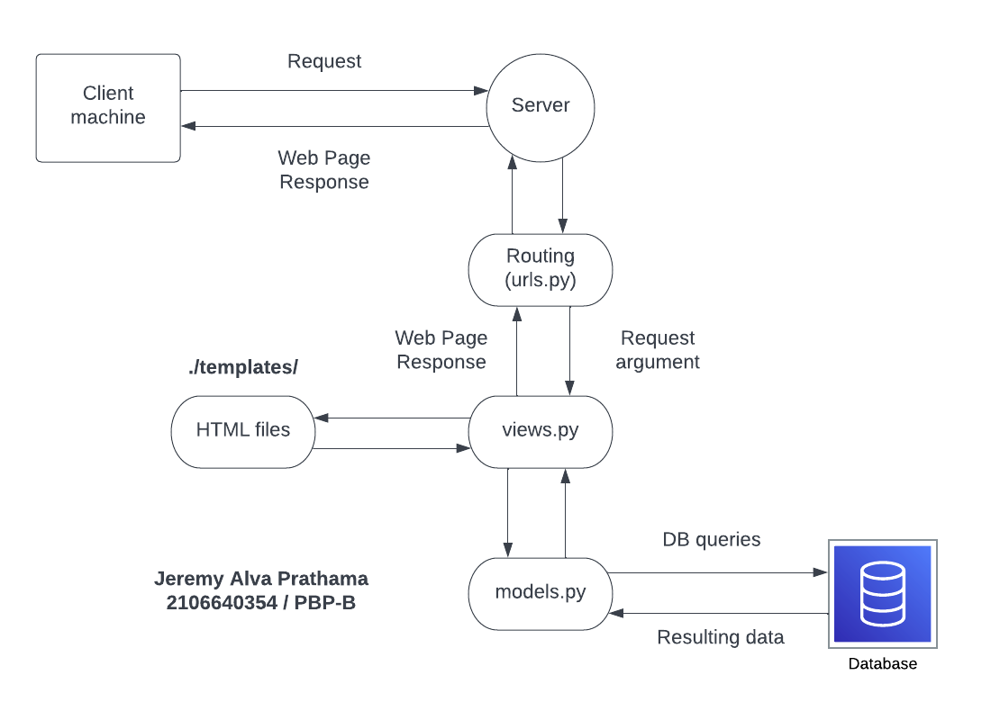

# Tugas 02 PBP Semester Ganjil 2022/2023
### By Jeremy Alva Prathama, NPM 2106640354, kelas B


## 1.0. Informasi Proyek
Dalam rangka memenuhi tugas 02 mata kuliah PBP, saya telah membuat halaman heroku yang mengimplementasikan model MVT dari framework Django. Laman tersebut dapat dilihat dibawah:  

[Cek laman tersebut di link berikut!](https://pbp-assignment-02.herokuapp.com/)

Terima kasih.


## 1.1. Diagram dan Penjelasan Alur Aplikasi


1. Client machine akan mengirimkan HTTP request ke server, berisikan laman yang diminta. 

2. Server django kemudian akan melakukan routing lewat file urls.py sesuai dengan request laman tersebut.
   
3. urls.py akan memberikan request sebagai argument kepada views.py. 

4. views.py menerima request dan berinteraksi dengan models.py untuk melakukan retrieve data dari django database. 

5. Setelah data diterima, views.py akan meneruskan data tersebut ke template yang merupakan file HTML. 

6. Template akan memasukkan data dari backend ke dalam web page yang telah ada, dan web page yang terbentuk akan dikirimkan kembali ke views. 

7. Views akan mengirimkan web page response kepada routing untuk nantinya di kembalikan kepada client machine.

## 1.2. Mengapa Perlu Menggunakan Virtual Environment
Virtual environment ada agar kita dapat mengisolasi satu proyek dengan proyek yang lain. Setiap proyek mungkin membutuhkan dependency yang berbeda-beda, dan bila kita menggabungkan semua dependency proyek dalam satu environment lokal, timbul beberapa potensi masalah yang dapat mengakibatkan incompatibility dalam proyek kita. 

Dengan menggunakan virtual environment, kita dapat menghindari timbulnya masalah dependency bila kita ingin membuat proyek-proyek lain di masa mendatang.


## 1.3. Langkah Implementasi Proyek
1. Pada views.py yang terletak pada app katalog, buatlah fungsi show_katalog yang menerima argument *request* dan mengembalikan *return value* dari fungsi render()
   
   1.1.  Import fungsi render dan model class dengan kode berikut

   ```
   from django.shortcuts import render
   from katalog.models import CatalogItem
   ```

   1.2. Pada fungsi show_katalog, ambil seluruh list object pada model yang dibuat. 
   ```
   data_list_katalog = CatalogItem.objects.all()
   ```

   1.3. Buatlah juga variabel *response* berupa dictionary yang akan mengembalikan data kepada Template
   ```
   response = {
        'nama': 'Jeremy Alva Prathama',
        'npm': '2106640354',
        'list_katalog': data_list_katalog,
    }
   ```

   1.4. Terakhir, return hasil pemanggilan render(). Hasilnya seperti dibawah ini:

   ```
   def show_katalog(request):
    data_list_katalog = CatalogItem.objects.all()
    response = {
        'nama': 'Jeremy Alva Prathama',
        'npm': '2106640354',
        'list_katalog': data_list_katalog,
    }
    return render(request, "katalog.html", response)
   ```

2. Lakukan routing pada urls.py untuk fungsi yang telah dibuat pada views.

   2.1. Pada katalog/urls.py: Kita dapat menambahkan routing lewat path() pada urlpatterns
   ```
   urlpatterns = [
      ...
      path('', show_katalog, name='show_katalog'),
   ]
   ```

   2.2. Pada project_django/urls.py, kita melakukan hal serupa dengan menambahkan:
   ```
   urlpatterns = [
      ...
      path('katalog/', include('katalog.urls')),
   ]
   ```
3. Lakukan migrasi data dari models agar dapat digunakan pada template. Karena models dan fixtures sudah tersedia dari template, kita tinggal jalankan kode berikut pada terminal:
   ```
   python manage.py makemigrations
   python manage.py migrate
   python manage.py loaddata initial_catalog_data.json
   ```
4. Lakukan pemetaan data dari views tadi ke templates.
   4.1. Masukkan data diri berupa nama dan npm dengan menggunakan django template syntax. Tambahkan CSS classes bila ingin melakukan styling.
   ```
   <h1 class="title">Lab 1 Assignment PBP/PBD</h1>
  
   <h5 class="name_header">Name: </h5>
   <p class="name_data">{{ nama }}</p>

   <h5 class="id_header">Student ID: </h5>
   <p class="id_data">{{ npm }}</p>
   ```

   4.2. Tambahkan tabel data yang akan mendisplay data dari argument list_katalog yang terletak dalam response. list_katalog mengandung data initial_catalog_data.json.
   ```
   <table>
      <tr>
        <th>Item Name</th>
        <th>Item Price</th>
        <th>Item Stock</th>
        <th>Rating</th>
        <th>Description</th>
        <th>Item URL</th>
      </tr>
       Add the data below this line 
      
      <tr>
        <td>
          {{katalog.item_name}}
        </td>
        <td>
          Rp{{katalog.item_price}}
        </td>
        <td>
          {{katalog.item_stock}} pcs
        </td>
        <td>
          {{katalog.rating}}/5
        </td>
        <td>
          {{katalog.description}}
        </td>
        <td>
          <a href={{katalog.item_url}}>{{katalog.item_name}}</a>
        </td>
      </tr>
      
    </table>
    ```

    4.3. Tambahkan styling CSS bila diperlukan

5. Deploy proyek django ke Heroku

   [Referensi dari Lab 0](https://pbp-fasilkom-ui.github.io/ganjil-2023/assignments/tutorial/tutorial-0#tutorial-melakukan-deploy-aplikasi-django-ke-heroku)

   5.1. Masuklah ke laman utama Heroku, dan buat aplikasi Heroku yang baru

   5.2. Salin HEROKU_API_KEY dan HEROKU_APP_NAME, kemudian masukkan ke Secrets/Actions dari GitHub repository anda

   5.3. Salin kode dpl.yml yang telah diberikan pada Lab 0

   5.4. Push kode dari repository lokal ke GitHub

   5.5. GitHub akan melakukan proses deployment setelah proses push 

6. Cek kembali Heroku app anda, pilih "Open App". Aplikasi Django telah berhasil di deploy.


## Credits

Laman template ini dibuat berdasarkan [PBP Ganjil 2021](https://gitlab.com/PBP-2021/pbp-lab) yang ditulis oleh Tim Pengajar Pemrograman Berbasis Platform 2021 ([@prakashdivyy](https://gitlab.com/prakashdivyy)) dan [django-template-heroku](https://github.com/laymonage/django-template-heroku) yang ditulis oleh [@laymonage, et al.](https://github.com/laymonage). Template ini dirancang sedemikian rupa sehingga mahasiswa dapat menjadikan template ini sebagai awalan serta acuan dalam mengerjakan tugas maupun dalam berkarya.